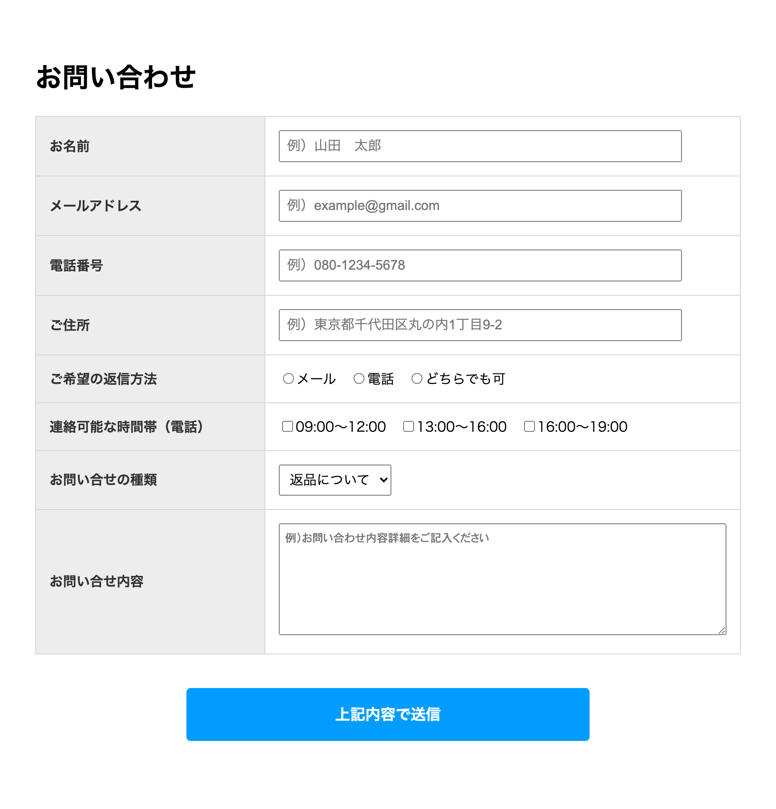

# bootcamp-2021-ts

お題： 配列「items」から TypeScript で Form を動的に作成してください

- 配列はループを使って処理すること
- 配列は「Item 型」と互換性のある Object が受け入れられる様にすること
- 配列「items」は改変しないこと
- 「Item 型」は改変しても構わない

### 配列 items

```typescript
const items: Item[] = [
  {
    name: "name",
    label: "お名前",
    tagName: "input",
    type: "text",
    placeholder: "例）山田　太郎",
  },
  {
    name: "email",
    label: "メールアドレス",
    tagName: "input",
    type: "email",
    placeholder: `例）example@gmail.com`,
  },
  {
    name: "tel",
    label: "電話番号",
    tagName: "input",
    type: "tel",
    placeholder: "例）080-1234-5678",
  },
  {
    name: "address",
    label: "ご住所",
    tagName: "input",
    type: "text",
    placeholder: "例）東京都千代田区丸の内1丁目9-2",
  },
  {
    name: "contact",
    label: "ご希望の返信方法",
    tagName: "input",
    type: "radio",
    values: [
      { label: "メール", value: 0 },
      { label: "電話", value: 1 },
      { label: "どちらでも可", value: 2 },
    ],
  },
  {
    name: "time",
    label: "連絡可能な時間帯（電話）",
    tagName: "input",
    type: "checkbox",
    values: [
      { label: "09:00〜12:00", value: 0 },
      { label: "13:00〜16:00", value: 1 },
      { label: "16:00〜19:00", value: 2 },
    ],
  },
  {
    name: "inquiry_kind",
    label: "お問い合せの種類",
    tagName: "select",
    options: [
      { text: "返品について", value: 0 },
      { text: "発送について", value: 1 },
      { text: "その他", value: 2 },
    ],
  },
  {
    name: "inquiry_detail",
    label: "お問い合せ内容",
    tagName: "textarea",
    placeholder: "例）お問い合わせ内容詳細をご記入ください",
  },
];
```

### Item 型

```typescript
type Item = {
  name: string;
  tagName: string;
  type?: string;
  label: string;
  placeholder?: string;
  values?: { label: string; value: number }[];
  options?: { text: string; value: number }[];
};
```

### 完成イメージ


